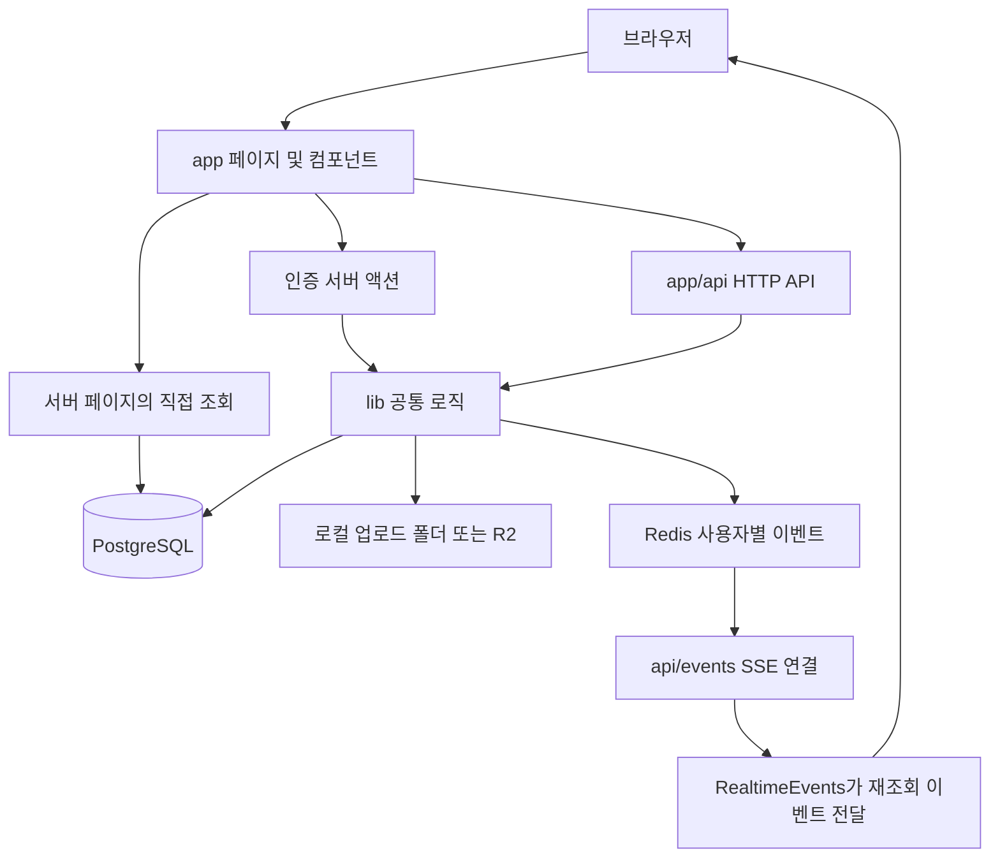

# Developer Blog 코드 기능 정리

작성 기준: 2026-09-12, 현재 작업 폴더의 소스 코드. 이 문서는 구현을 읽고 정리한 것으로, 서비스를 실행해 모든 기능이 정상이라고 검증한 보고서는 아닙니다.

## 1. 문서 읽는 방법

- **이 문서**: 프로젝트 구조, 파일별 함수의 기능, 중요한 코드 블록, 데이터 흐름과 현재 구현의 제약을 설명합니다.
- **[FUNCTION_INDEX.md](FUNCTION_INDEX.md)**: 함수 선언·화살표 함수·객체 메서드·익명 콜백을 소스 위치와 함께 찾아보는 전체 색인입니다. 같은 이름이 반복되면 파일과 상위 함수로 구분합니다.
- 파일 경로는 저장소 루트 기준입니다. 실제 웹 애플리케이션 루트는 `project/`입니다.
- 직접 작성한 코드는 아래에서 개별 함수와 관련 콜백을 설명합니다. `project/generated/prisma/`의 반복되는 자동 생성 타입과 DB 메서드는 9절에서 공통 규칙과 모델별 역할로 설명합니다.
- `node_modules`, `.next`, `.git`, 실제 `.env` 값은 설명 대상이 아닙니다. 외부 라이브러리 전체 구현과 빌드 산출물을 프로젝트에서 작성한 코드로 취급하지 않습니다.

처음 읽는다면 **전체 흐름 → 페이지 → 글쓰기 → 공통 서버 로직 → API → DB** 순서가 좋습니다. 특정 버튼이 궁금하면 해당 컴포넌트의 함수에서 시작해 `fetch()`의 주소를 API 표에서 찾으면 됩니다.

## 2. 전체 구조와 실행 흐름

이 프로젝트는 개발 블로그입니다. 글·카테고리·임시저장·이미지·좋아요·댓글·조회수·친구·알림·1:1 채팅·달력 할 일을 제공합니다.

| 경로 | 역할 |
| --- | --- |
| `project/app/` | URL별 페이지, 공통 화면, API, 서버 액션 |
| `project/app/write/` | Tiptap 편집기, 이미지 삽입·크기 조절, 임시저장·발행 |
| `project/app/components/` | 여러 화면에서 사용하는 UI 및 브라우저 상호작용 |
| `project/app/mypage/` | 프로필·내 글·친구·좋아요·카테고리·일정 관리 |
| `project/app/api/` | HTTP 요청을 받아 인증·검증·DB 변경 후 응답하는 서버 코드 |
| `project/app/actions/auth.ts` | 폼에서 호출하는 가입·로그인 서버 액션 |
| `project/lib/` | 인증, 공개 범위, 본문 검증, 이미지 저장, 채팅 등 공통 로직 |
| `project/prisma/` | DB 모델 정의와 SQL 변경 이력 |
| `project/generated/prisma/` | 스키마에서 자동 생성된 DB 클라이언트와 타입 |
| `project/tests/` | 단위 테스트와 DB·서버를 사용하는 통합 테스트 |
| `project/scripts/` | 테스트 게시글 생성 스크립트 |
| `project/public/` | 기본 SVG 정적 자원 |
| `project/docs/` | 기존 배포·이미지·글 읽기 문서 |
| `docker-compose.yml` | PostgreSQL, Redis, DB 백업 컨테이너 구성 |

### 코드에서 자주 나오는 표현

| 코드 | 이 프로젝트에서의 의미 |
| --- | --- |
| `"use client"` | 상태, 클릭, 브라우저 저장소 등을 사용하는 클라이언트 컴포넌트 경계 |
| `"use server"` | 클라이언트 폼에서 호출할 수 있는 서버 액션 선언 |
| `auth()` | 현재 요청의 로그인 세션 조회 |
| `session?.user?.id` | 로그인 사용자의 ID. 없으면 보호된 요청을 거절하거나 로그인으로 이동 |
| `prisma.xxx` | `xxx` 모델의 DB 조회·저장 메서드 |
| `where / select / include` | 조회 조건 / 가져올 필드 / 같이 가져올 관계 |
| `Promise.all(...)` | 서로 독립적인 여러 조회를 함께 기다림 |
| `useState` | 화면 변경을 일으키는 상태 |
| `useRef` | 렌더링을 직접 일으키지 않는 DOM 참조·요청 번호·저장 상태 |
| `useEffect`의 반환 함수 | 이벤트·타이머·연결 정리 또는 늦은 응답 무효화 |
| `useCallback / useMemo` | 함수 참조 / 계산 결과를 의존성에 따라 재사용 |
| `router.refresh()` | 서버에서 받은 화면 데이터를 다시 요청 |
| `map / filter / find / some / reduce` | 목록 변환 / 선별 / 검색 / 조건 검사 / 합계 등 누적 계산 |
| `Response.json()` | API 결과와 HTTP 상태 코드를 반환 |
| `PostError` | 사용자에게 보여줄 메시지와 HTTP 오류 상태를 담는 예외 |
| `updatedAt / version` | 오래된 화면에서 다른 창의 변경을 덮어쓰지 않도록 비교하는 값 |
| `@/` | `project/`를 가리키는 TypeScript 경로 별칭 |

## 3. 페이지와 공통 레이아웃

| 파일 / 함수 | 입력·역할·결과 |
| --- | --- |
| [app/layout.tsx](project/app/layout.tsx) · `RootLayout({ children })` | 전체 페이지를 한국어 HTML, 폰트, 헤더, 본문 건너뛰기 링크, 푸터로 감쌉니다. `metadata`는 기본 제목·설명, `geistSans / geistMono`는 폰트 CSS 변수입니다. |
| 같은 파일의 초기 테마 IIFE | HTML 초기 로딩 때 localStorage와 OS 테마를 읽고 `html.dark`를 먼저 적용해 테마가 뒤늦게 바뀌는 현상을 줄입니다. 문자열 안의 즉시 실행 함수입니다. |
| [app/page.tsx](project/app/page.tsx) · `HomePage({ searchParams })` | 로그인·친구 관계에 따라 읽을 수 있는 글을 조회합니다. 페이지 번호를 검증하고 15개씩 최신순으로 보여줍니다. 본문에서 요약·첫 이미지·좋아요 여부를 만들고 인기 순위도 전달합니다. |
| [app/blog/[authorId]/page.tsx](project/app/blog/%5BauthorId%5D/page.tsx) · `BlogPage` | 작성자·카테고리를 확인하고 `blogData`로 선택된 카테고리와 페이지를 조회해 `BlogExplorer`를 표시합니다. 없는 작성자는 404입니다. |
| [app/posts/[id]/page.tsx](project/app/posts/%5Bid%5D/page.tsx) · `PostPage` | 글의 작성자를 찾고 그 작성자의 `blogData` 결과에 해당 글이 있는지 확인한 뒤 상세 화면을 표시합니다. **현재는 첫 페이지 15개 안에서만 찾는 제약**이 있습니다. |
| [app/posts/[id]/edit/page.tsx](project/app/posts/%5Bid%5D/edit/page.tsx) · `EditPostPage` | 로그인과 글 소유권을 검사하고 기존 글·카테고리를 `WriteForm.initialPost`에 전달합니다. |
| [app/write/page.tsx](project/app/write/page.tsx) · `WritePage` | 로그인 사용자 카테고리를 조회하고 새 글용 `WriteForm`을 표시합니다. |
| [app/login/page.tsx](project/app/login/page.tsx) · `LoginPage` | `useActionState(loginAction, null)`로 로그인 폼의 결과·처리 상태를 표시합니다. Google 로그인은 별도 폼입니다. |
| [app/signup/page.tsx](project/app/signup/page.tsx) · `SignupPage` | 회원가입 폼을 서버 액션에 연결하고, 성공 시 인증메일 안내 화면으로 바꿉니다. 재발송 버튼의 익명 비동기 콜백은 처리 상태를 바꾸고 `resendVerificationEmailAction`을 호출합니다. |
| [app/verify-email/page.tsx](project/app/verify-email/page.tsx) · `VerifyEmailPage` | URL 토큰이 없으면 안내 화면, 있으면 `verifyAndCreateUser`의 성공·실패 결과를 표시합니다. 이 페이지 요청은 실제 사용자 생성으로 이어질 수 있습니다. |
| [app/mypage/page.tsx](project/app/mypage/page.tsx) · `MyPage` | 로그인 사용자·카테고리·게시글 수·친구 수·친구 목록을 조회합니다. `tab`, `post`, `category`, `page`를 읽어 관리 화면과 좋아요 목록을 구성합니다. |

## 4. 가입·로그인·사용자 정보

### `project/app/actions/auth.ts`

| 함수 | 하는 일 |
| --- | --- |
| `signUpAction(prevState, formData)` | 이름·닉네임·이메일·비밀번호·확인값을 읽습니다. 길이·중복 이메일·비밀번호 일치를 검사하고 bcrypt 비용 10으로 해시를 만듭니다. 가입 토큰을 저장하고 인증메일 발송을 요청합니다. 아직 `User`는 만들지 않습니다. 결과는 `{ error }` 또는 `{ success, email }`입니다. |
| `loginAction(prevState, formData)` | 이메일을 정리하고 `signIn("credentials")`를 호출합니다. 성공하면 `/`로 이동하고, 인증 오류는 한국어 메시지로 변환합니다. 인증 오류가 아닌 예외는 다시 던져 프레임워크 리다이렉트를 유지합니다. |
| `googleLoginAction()` | Google 인증을 시작하고 완료 후 `/`로 이동하도록 요청합니다. |
| `logoutAction()` | 세션 로그아웃 후 `/`로 이동합니다. |
| `resendVerificationEmailAction(email)` | 이미 가입한 사용자는 거절하고 대기 토큰을 검색해 **기존 토큰**이 담긴 메일을 다시 보냅니다. 새 토큰 발급·만료 연장은 하지 않습니다. |

### `project/lib/auth.ts`

`NextAuth` 설정은 Google·이메일/비밀번호 인증, Prisma 어댑터, JWT 세션, 로그인 페이지(`/login`)를 연결합니다. 반환값 `handlers`, `auth`, `signIn`, `signOut`은 라이브러리가 만든 함수입니다.

| 콜백 | 하는 일 |
| --- | --- |
| `authorize(credentials)` | 이메일로 사용자를 조회하고 저장된 비밀번호 해시와 비교합니다. 잘못된 자격증명은 `null`, 미인증 이메일은 `EmailNotVerified` 오류, 성공은 사용자 프로필을 반환합니다. |
| `jwt({ token, user })` | 로그인 시 DB 프로필을 토큰에 반영합니다. 닉네임·태그가 없으면 생성해 DB에 저장합니다. 마지막으로 `displayName`으로 과거 이름 뒤에 붙은 태그를 정리합니다. |
| `session({ session, token })` | 토큰의 ID·이름·닉네임·태그를 세션 사용자 객체로 옮깁니다. |

### 인증 보조 파일

| 파일 / 함수 | 하는 일 |
| --- | --- |
| `lib/tokens.ts` · `createSignupVerificationToken(payload)` | UUID 토큰과 24시간 만료 시각을 생성합니다. 이메일을 포함한 기존 `identifier` 토큰을 지우고 가입 정보 JSON을 `identifier`에 저장합니다. 5% 확률로 만료된 토큰을 추가 정리합니다. |
| `lib/tokens.ts` · `verifyAndCreateUser(token)` | 토큰 존재·만료·JSON 파싱·이메일 중복을 검사합니다. 고유 태그와 `emailVerified`가 있는 `User`를 생성하고 사용한 토큰을 삭제합니다. |
| `lib/mail.ts` · `sendVerificationEmail(email, token)` | `NEXTAUTH_URL` 또는 로컬 주소로 인증 링크를 만듭니다. SMTP 설정이 있으면 Gmail로 HTML 메일을 보냅니다. 발송 오류는 로그에 남기지만 반환값은 `{ success: true, confirmLink }`입니다. 따라서 반환 성공이 메일 배달 성공을 보장하지 않습니다. |
| `lib/tag.ts` · `generateUniqueTag(nickname)` | 같은 닉네임의 사용 중인 태그를 조회합니다. `0001`~`9999` 중 무작위 50회 시도 후 빈 번호를 순차 검색합니다. 모두 사용 중이면 오류입니다. |
| `lib/display-name.ts` · `displayName(name, tag)` | 이름 끝의 `#숫자4자리`가 현재 계정 태그와 정확히 일치할 때만 떼어냅니다. 이름 중간의 `C#` 같은 문자열은 보존합니다. |

가입 흐름: `SignupPage → signUpAction → 토큰 저장 → 메일 → VerifyEmailPage → verifyAndCreateUser → User 생성 → LoginPage`.

## 5. 글쓰기와 본문 처리

### `project/app/write/WriteForm.tsx`

`WriteForm({ categories, userId, initialPost })`은 새 글·글 수정을 함께 처리합니다. `initialPost`가 있으면 편집 모드입니다. 기존 일반 문자열 본문도 문단 노드로 바꿔 편집기에 넣습니다.

| 주요 상태·참조 | 역할 |
| --- | --- |
| `title`, `tags`, `categoryId`, `visibility` | 저장할 글 기본 정보 |
| `showToc`, `tocDepth` | 본문 문서에 함께 저장할 목차 표시·깊이 |
| `storedDraft`, `draftPromptOpen`, `draftReady` | 복구할 임시 글과 복구 안내, 서버 초기 조회 완료 여부 |
| `dirty`, `revisionRef`, `revision` | 미저장 변경 여부 및 변경 순번. 저장 도중 새로 입력한 내용을 저장 완료로 오인하지 않도록 구분 |
| `draftVersion` | 서버 임시 글 버전. 다른 탭과의 충돌 검사에 전달 |
| `pendingSave` | 임시저장 요청을 앞 요청 뒤에 연결하는 Promise |
| `savingPaused`, `draftConflict`, `published` | 삭제·발행 중 저장 중지, 충돌 후 추가 저장 방지, 발행 완료 표시 |
| `uploadBusy`, `imageBusy`, `failedUpload` | 중복 업로드 방지·진행 표시·실패 파일 재시도 정보 |
| `draftKey`, `storageKey` | 서버의 `new` 또는 글 ID, 사용자별 브라우저 임시저장 키 |

| 함수·콜백 | 하는 일 |
| --- | --- |
| `useEditor` 설정 | StarterKit·글자 크기·강조색·정렬·이미지 확장을 등록합니다. 제목은 h2~h4를 사용하며 초기 즉시 렌더링을 끕니다. |
| `editorProps.handlePaste` | 클립보드 이미지 파일을 추출해 기본 붙여넣기를 막고 `pasteUpload`에 넘깁니다. |
| `onUpdate` | 편집기 내용 변경을 미저장 상태로 표시하고 변경 순번을 증가시킵니다. |
| `useEditorState.selector` | 커서·편집 기록 변화와 글자 수를 도구막대에 반영합니다. |
| 초기 `useEffect` | 서버 임시 글을 먼저 조회합니다. 서버에 없으면 이전 브라우저 임시 글을 복구 후보로 읽습니다. 정리 함수는 화면 종료 후 도착하는 응답을 무시하게 합니다. |
| `saveDraft()` | 편집 내용 스냅샷을 localStorage에 보관하고, 서버 PUT 요청을 순서대로 실행합니다. 반환값은 저장 성공 여부 Promise입니다. 409가 나면 충돌 상태로 멈춥니다. |
| 자동저장 `useEffect` | 변경 후 1.2초에 `saveDraft`를 호출하고, 다시 변경되면 앞 타이머를 취소합니다. |
| `warn(event)` | 미저장 내용 또는 업로드가 있으면 브라우저 창을 떠날 때 확인을 표시하도록 요청합니다. |
| `changed()` | 제목·태그·목차 등 편집기 밖 설정 변경도 미저장 상태와 변경 순번에 반영합니다. |
| `restoreDraft()` | 임시 글의 제목·태그·본문·공개 범위·목차를 복구합니다. 삭제되거나 구분선인 카테고리는 미분류로 바꿉니다. |
| `discardDraft()` | 사용자 확인 후 진행 중 저장을 기다리고 서버·브라우저 임시 글을 삭제합니다. 새 글은 빈 상태, 수정은 원래 글로 되돌립니다. |
| `openInsert(mode)` | 링크 또는 이미지 입력 창을 열고 이전 오류와 입력값을 정리합니다. 링크 수정이면 현재 링크를 미리 채웁니다. |
| `insertFromUrl(event)` | 주소를 검증하고 이미지 노드를 넣거나 선택 영역에 링크를 적용합니다. 선택 영역이 없으면 주소를 텍스트 링크로 삽입합니다. |
| `insertFiles(files, grouped)` | 형식·10MB 제한을 먼저 검사하고 파일을 순차 업로드합니다. 업로드 자리표시자를 추적해 완료된 이미지를 원래 삽입 위치에 넣습니다. 묶음 모드는 최대 3장 단위로 만듭니다. 실패 시 재시도 정보를 보존합니다. |
| `pasteUpload` 연결 effect | 붙여넣기 처리에 최신 `insertFiles`를 연결합니다. |
| `preparePublish()` | 업로드 중인지, 제목·본문이 있는지 확인하고 발행 설정 창을 엽니다. |
| `publish(event)` | 진행 중 임시저장을 기다린 뒤 본문을 직렬화해 새 글 POST 또는 수정 PATCH를 보냅니다. 성공 시 localStorage를 정리하고 상세 화면으로 이동합니다. |
| JSX의 미리보기 콜백 | 현재 편집 문서에 목차 설정을 넣고 직렬화해 `PostContent`로 미리 보여줍니다. |
| JSX의 입력·모달 콜백 | 입력 상태를 바꾸고 `changed()`를 호출하거나 집중 모드·발행 창·미리보기·삽입 창을 열고 닫습니다. |

### 편집기 보조 파일

| 파일 / 함수 | 하는 일 |
| --- | --- |
| `write/TagInput.tsx` · `TagInput` | 태그 목록·입력창·개수·오류 표시. 클릭 삭제, Enter·쉼표·포커스 이탈 시 추가합니다. 한글 조합 중 Enter는 제외합니다. |
| 같은 파일 · `add()` | 앞의 `#`와 공백을 정리하고 24자·10개 제한을 확인합니다. 중복 제거 후 부모의 `onChange`를 호출합니다. |
| `write/EditorToolbar.tsx` · `EditorToolbar` | 제목 단계, 크기, 강조색, 굵게·기울임·밑줄·취소선, 정렬, 목록, 인용, 코드, 구분선, 링크·이미지, 실행 취소·다시 실행을 편집기 명령에 연결합니다. |
| 같은 파일 · `tool(...)` | 선택 영역을 잃지 않도록 mousedown 기본 동작을 막는 공통 도구 버튼을 만듭니다. 활성·비활성·접근성 속성을 함께 설정합니다. |
| `write/ImageUpload.ts` · `ImageUpload.addProseMirrorPlugins()` | 업로드 위치를 문서 내용과 별도로 관리하는 ProseMirror 플러그인을 반환합니다. |
| 같은 파일 · `state.init` | 빈 DecorationSet으로 시작합니다. |
| 같은 파일 · `state.apply(tr, previous)` | 편집으로 위치가 이동하면 decoration 위치도 갱신합니다. `uploadKey` 메타데이터로 자리표시자를 추가·제거합니다. |
| 같은 파일 · `Decoration.widget` 콜백 | “이미지 업로드 중…” 안내 DOM을 생성합니다. 저장할 본문 JSON에는 포함하지 않습니다. |
| 같은 파일 · `props.decorations` | 현재 편집기 상태에 해당하는 decoration 목록을 반환합니다. |

### 단일 이미지 크기 조절: `write/ResizableImage.tsx`

- `ResizableImageComponent`: 선택된 이미지에 좌우 드래그 핸들·크기 프리셋·이동·삭제·아래 이미지와 묶기 도구를 보여줍니다.
- `handlePointerDown(direction)`: 방향을 받아 실제 포인터 시작 핸들러를 반환합니다. 최초 이미지·부모 너비를 기록하고 전역 포인터 이벤트를 등록합니다.
- `onPointerMove`: 이동량으로 너비를 계산해 15~100% 범위의 미리보기 상태를 갱신합니다. 최소 픽셀 계산값은 80px입니다.
- `onPointerUp`: 이벤트를 해제하고 최종 `%` 너비를 `updateAttributes`로 편집기 문서에 저장합니다.
- `setPreset(percent)`: 25·50·75·100% 버튼과 더블 클릭의 너비 변경입니다.
- `ResizableImage.addAttributes`: 기본 이미지 속성에 `width`를 추가합니다. `parseHTML`은 HTML style·width를 읽고, `renderHTML`은 너비 속성·style을 내보냅니다.
- `ResizableImage.addNodeView`: 이미지 노드의 편집 화면을 위 React 컴포넌트에 연결합니다.
- 인라인 묶기 콜백은 다음 노드가 이미지일 때 두 노드를 `imageGroup`으로 교체합니다. `deleteNode`는 편집 문서에서 이미지를 제거합니다. 실제 저장 파일 삭제는 이후 정리 작업이 담당합니다.

### 이미지 묶음: `write/ImageGroup.tsx`

- `ImageGroupView`: 2~3장의 이미지와 도구를 보여줍니다. ProseMirror의 실제 자식 DOM은 숨기고 별도 그리드로 표시해 중복 렌더링을 피합니다.
- `handlePointerDown`, `onPointerMove`, `onPointerUp`: 묶음 전체의 너비를 조절합니다. 단일 이미지와 같은 흐름이며 최소 픽셀 계산값은 120px입니다.
- `setPreset`: 묶음 전체 너비 프리셋을 적용합니다.
- `replace(content)`: 현재 묶음을 전달된 이미지 배열로 교체합니다. 1장만 남으면 단일 이미지로 바꿉니다.
- `resize(index, delta, base)`: 인접한 두 이미지의 합계 너비를 유지하면서 각 이미지의 최소 비율 15%를 보장하는 배열을 반환합니다.
- 경계선 `onPointerDown` 내부 `move`: 드래그를 퍼센트 차이로 바꾸고 `resize` 결과를 임시 화면에 표시합니다.
- 경계선 `finish`: 포인터 이벤트를 제거하고 최종 비율을 쉼표 문자열로 저장합니다. 키보드 좌우 방향키는 2% 단위로 조절합니다.
- JSX 콜백은 높이 맞춤/원본 비율 전환, 같은 너비, 묶음 해제, 다음 이미지 합치기, 이미지 순서 교환·삭제·분리를 담당합니다.
- `ImageGroup.addAttributes`: `widths`, `mode`, `width`의 기본값과 HTML 읽기·쓰기 콜백을 정의합니다.
- `ImageGroup.parseHTML`: `div[data-image-group]`를 이미지 묶음으로 인식합니다.
- `ImageGroup.renderHTML`: 묶음의 HTML 태그·속성·자식 위치를 반환합니다.
- `ImageGroup.addNodeView`: `ImageGroupView`를 연결합니다. 노드 스키마의 `image{2,3}`은 자식이 이미지 2~3개라는 뜻입니다.

### 본문 형식: `project/lib/post-content.ts`

본문은 HTML 원문 대신 **`DB_RICH_TEXT_V1:` + JSON 문자열**로 저장합니다. `PostNode`는 노드 종류·문자열·속성·서식·자식을 표현합니다. 읽을 때와 저장할 때 같은 허용 목록을 사용합니다.

| 함수 | 입력 → 처리 → 출력 |
| --- | --- |
| `safeLink(value)` | 알 수 없는 입력 → URL 파싱과 프로토콜 검사 → http·https·mailto URL 또는 `null` |
| `safeImage(value)` | 입력 → 내부 UUID WebP 경로 또는 http·https 주소 검사 → 이미지 주소 또는 `null` |
| `safeWidth(value)` | 입력 → 1~100% 또는 50~1600px 검사 → 정리된 너비 또는 `null` |
| `imageGroupWidths(value, count)` | 쉼표 비율 → 개수·유한수·15~85%·합계 약 100 검사 → 비율 배열. 잘못되면 균등 분배 |
| `normalizeDocument(input, allowLegacyImages)` | 문서 → 허용 노드·속성·서식으로 정리 → `PostNode`. 잘못된 구조는 예외 |
| 위 함수의 `visit(value, depth)` | 노드 재귀 순회. 깊이 32·노드 10,000개 제한, 제목 단계·정렬·이미지 URL·너비·서식·목차·이미지 묶음을 검사 |
| `serializeDocument(doc)` | 정규화한 문서를 접두사와 JSON으로 변환합니다. 문자열 길이 5,000,000을 넘으면 거절합니다. 바이트 수 제한과는 다릅니다. |
| `readDocument(content)` | 접두사·길이를 검사하고 JSON 파싱·정규화를 수행합니다. 과거 PNG/JPEG/WebP base64 이미지는 읽기 호환을 허용합니다. 실패 또는 일반 문자열이면 `null` |
| `documentText(node)` | 재귀적으로 텍스트를 모읍니다. 이미지는 제외, 문단·제목·목록 항목 등에는 줄바꿈 추가 |
| `hasDocumentContent(doc)` | 공백 아닌 텍스트나 이미지가 있는지 판단 |
| `postExcerpt(content)` | 리치 본문에서 텍스트 요약을 얻습니다. 이미지뿐이면 안내 문구, 일반 문자열이면 그대로 반환 |
| `imageSources(node)` | 단일 이미지 src 또는 자식 전체의 이미지 URL 배열 반환 |
| `documentOutline(doc, prefix, maxDepth)` | 제목에서 `{ id, text, level, index }` 목록 생성 |
| 위 함수의 `visit(node)` | 모든 제목의 순번은 증가시키되 빈 제목·깊이 밖 제목은 목록에서 제외합니다. 실제 렌더러의 제목 ID와 순서를 맞춥니다. |

`FONT_SIZES`, `HIGHLIGHT_COLORS`는 허용 서식 값이고, `types`, `markTypes`는 허용 노드·서식 종류입니다. 사용자 지정 CSS나 임의 HTML 속성을 그대로 보존하지 않습니다.

## 6. 공통 서버 로직

### DB 연결과 글 공개 범위

| 파일 / 함수 | 역할 |
| --- | --- |
| `lib/prisma.ts` · 모듈 초기화 | `DATABASE_URL`로 PostgreSQL 어댑터를 만들고 시간대를 UTC로 지정합니다. 개발 중에는 전역 객체에 Prisma 인스턴스를 재사용합니다. 별도 선언 함수는 없습니다. |
| `lib/post-access.ts` · `visiblePosts(authorId, viewerId)` | 해당 작성자의 글 조회 조건을 반환합니다. 본인은 전체, 수락된 친구는 PUBLIC·FRIENDS, 나머지는 PUBLIC입니다. |
| 같은 파일 · `allVisiblePosts(viewerId)` | 모든 작성자에 대한 접근 조건입니다. 공개 글, 본인 글, 수락된 친구의 친구 공개 글을 합칩니다. |
| `lib/blog-data.ts` · `blogData(authorId, viewerId, page, category)` | 작성자 확인 후 공개 범위·카테고리 조건을 적용합니다. 카테고리, 15개 게시글, 글 수, 카테고리별 수, 본인 임시 글, 친구 관계를 조회하고 날짜를 ISO 문자열로 바꿉니다. 없는 작성자는 `null`입니다. |
| `lib/post-stats.ts` · `popularRankings(viewerId)` | 같은 기준 시각으로 최근 1·7·30일 순위를 병렬 조회합니다. |
| 같은 파일 · `popularPosts(days, now, viewerId)` | 기간 내 공개 글 조회수를 집계해 상위 5개를 구합니다. 순위대로 요약·썸네일·좋아요 여부·기간 조회수를 반환합니다. 달력상의 이번 주가 아닌 최근 7일입니다. |

### `project/lib/post-service.ts`

| 함수 / 클래스 | 역할 |
| --- | --- |
| `PostError.constructor(message, status = 400)` | 오류 메시지와 HTTP 상태 코드를 보관합니다. |
| `mediaTransaction(fn)` | PostgreSQL advisory lock `74209136`을 획득한 트랜잭션 안에서 `fn(tx)`를 실행합니다. 이미지 참조 변경과 정리가 여러 서버에서 동시에 엇갈리지 않게 직렬화합니다. 대기 15초·실행 30초 제한입니다. |
| `ensureImages(tx, content, userId)` | 본문의 내부 이미지 이름을 중복 제거해 추출하고 실제 소유자가 작성자인지 확인합니다. 이미지 레지스트리를 upsert한 후 이름 배열을 반환합니다. 외부 URL은 소유권 검사 대상이 아닙니다. |
| `refreshOrphans(tx)` | 어떤 글·임시 글도 참조하지 않는 이미지에 미사용 시각을 지정합니다. 다시 참조된 이미지의 미사용 시각은 없앱니다. |
| `setPostImages(tx, postId, names)` | 해당 글의 이미지 연결을 지우고 현재 목록으로 다시 만듭니다. |
| `setDraftImages(tx, draftId, names)` | 임시 글의 이미지 연결을 같은 방식으로 교체합니다. |
| `validatePost(tx, input, userId, draft)` | 제목·본문 길이와 내용, 작성자 카테고리, 공개 범위, 태그, 이미지 소유권을 검사합니다. 저장용 `data`와 내부 이미지 `names`를 반환합니다. 임시 글에서는 제목 공백·빈 문서 조건을 일부 완화합니다. |
| `consumeDraft(tx, userId, key, version)` | 발행에 사용하는 임시 글 버전을 검사하고 삭제합니다. 다른 창에서 삭제·변경된 경우 409로 충돌을 알립니다. |
| `postFailure(error)` | `PostError`는 지정 상태, JSON 문법 오류는 400, 기타 오류는 로그와 일반화된 500 응답으로 바꿉니다. |

발행 순서: `validatePost → consumeDraft → post.create/update → setPostImages → refreshOrphans`. 이 작업들을 하나의 `mediaTransaction` 안에서 처리합니다.

### 이미지 저장·정리

| 파일 / 함수 | 역할 |
| --- | --- |
| `lib/image-storage.ts` · `directory()` | `UPLOAD_DIR` 또는 현재 실행 폴더의 `storage/uploads` 절대 경로 |
| 같은 파일 · `useR2()` | R2 endpoint·키·secret·bucket 네 값이 모두 있는지 판별 |
| 같은 파일 · `r2()` / `bucket()` | S3 호환 클라이언트 생성 / bucket 환경변수 반환 |
| 같은 파일 · `ImageUploadError` | 이미지 입력 오류를 일반 서버 오류와 구분하는 Error 하위 클래스 |
| 같은 파일 · `saveImage(bytes, ownerId)` | 10MB 이하·4천만 픽셀 이하의 단일 JPEG/PNG/WebP를 디코딩합니다. 회전 정보를 반영하고 가로·세로 1600px 안으로 축소, 품질 85 WebP로 변환합니다. UUID 파일과 소유자 메타데이터를 R2 또는 로컬에 저장하고 `{ url }`을 반환합니다. |
| 같은 파일 · `imageOwner(name)` | UUID WebP 파일명 확인 후 R2 metadata 또는 로컬 `.webp.json`에서 소유자를 조회합니다. 없는 파일 등은 `null`입니다. |
| 같은 파일 · `readImage(name)` | 파일명을 검증하고 R2 또는 로컬 이미지의 바이트를 읽습니다. 접근 권한 검사는 호출하는 API에서 수행합니다. |
| 같은 파일 · `storedImages()` | 저장소에서 유효한 이미지 파일명을 나열합니다. 현재 R2 목록은 한 번의 ListObjectsV2 응답만 사용합니다. |
| 같은 파일 · `removeImage(name)` | R2 객체 또는 로컬 이미지·JSON 메타데이터를 삭제합니다. |
| `lib/image-cleanup.ts` · `cleanupImages()` | 기존 파일의 누락 레지스트리를 등록하고 모든 글·임시 글의 이미지 참조를 재구성합니다. 24시간 이상 미사용이고 연결이 없는 이미지를 최대 100개 삭제합니다. `{ deleted }` 반환 |
| 같은 파일 · `namesFor(content, owner)` | 정규화된 본문에서 해당 소유자의 등록된 내부 이미지 이름만 중복 없이 추립니다. |
| 같은 파일 · `startImageCleanup()` | 전역 타이머 중복 생성을 막고 시작 1분 후 및 이후 매시간 정리 작업을 예약합니다. |
| 같은 파일 · `run()` | 같은 프로세스에서 정리 작업이 겹치지 않도록 `running`을 확인합니다. 오류를 기록하고 실행 플래그를 복구합니다. |
| `instrumentation.ts` · `register()` | Node.js 서버 실행 시 정리 타이머를 시작합니다. production build 단계에서는 시작하지 않습니다. |

이미지 흐름: `파일 업로드 → WebP 저장 + ImageAsset 등록 → 글/임시 글의 이미지 연결 → 연결이 없어짐 → orphanedAt 지정 → 24시간 후 정리`.

### 좋아요·댓글·요청 검증: `lib/engagement.ts`

| 함수 | 역할 |
| --- | --- |
| `readablePost(id, viewerId)` | 글 존재와 `visiblePosts` 조건을 검사합니다. 읽을 수 없으면 404, 가능하면 글 ID·작성자 ID 반환 |
| `checkMutation(request)` | Origin·Host·`sec-fetch-site`로 다른 출처의 요청을 검사하고 JSON Content-Type을 요구합니다. 이 함수를 호출하는 API에 적용되며 모든 API가 공통 사용하지는 않습니다. |
| `fingerprint(value)` | `AUTH_SECRET`을 키로 HMAC-SHA256 해시를 만듭니다. 조회수 식별자·방문자 서명·요청 제한 키에 사용합니다. |
| `limitAction(request, action, identity, max, minutes)` | DB의 `ActionLimit`에 원자적으로 카운트를 기록하고 제한 초과 시 429를 냅니다. 신뢰 프록시 설정이 있을 때만 전달 IP를 사용합니다. 기본은 10분 20회입니다. |
| `commentContent(value)` | 공백 제거 후 1~2,000자인 댓글 본문을 반환하거나 거절합니다. |
| `commentPassword(value)` | 4자 이상이고 UTF-8 72바이트 이하인 비밀번호를 확인합니다. |

### 친구·채팅·실시간 전송

| 파일 / 함수 | 역할 |
| --- | --- |
| `lib/friend-handle.ts` · `parseFriendHandle(value)` | 최대 100자 입력의 마지막 `#숫자4자리`를 분리합니다. `C# 개발자#0001`도 지원하며 태그 앞자리 0을 보존합니다. 실패 시 `null` |
| `lib/friend-request.ts` · `sendFriendRequest(senderId, recipientId)` | 자기 자신 요청을 막고 사용자 쌍 잠금 안에서 수신자 존재·기존 관계를 확인합니다. 없으면 PENDING 관계를 만들고 양쪽에 friends 이벤트를 보냅니다. |
| `lib/chat.ts` · `pairWhere(a, b)` | 양방향 친구 관계를 찾는 OR 조건을 만듭니다. |
| 같은 파일 · `lockPair(tx, a, b)` | 정렬한 사용자 ID 쌍을 해시해 트랜잭션 잠금을 잡습니다. 같은 두 사용자에 대한 일부 친구·대화 변경을 직렬화합니다. |
| 같은 파일 · `requireFriends(a, b, db)` | 서로 다른 사용자이며 ACCEPTED 관계인지 확인하고 아니면 403을 던집니다. |
| 같은 파일 · `conversationFor(id, userId)` | 현재 사용자가 A 또는 B인 대화와 양쪽 공개 프로필을 반환합니다. 참여자가 아니면 404입니다. |
| 같은 파일 · `chatProfile` | 채팅에서 조회할 ID·이름·태그·닉네임·이미지 필드 집합 |
| `lib/realtime.ts` · `redisClient()` | Redis 클라이언트를 만듭니다. 기본 주소는 로컬, 연결 제한 2초, 오프라인 큐·자동 재접속은 끕니다. |
| 같은 파일 · `userChannel(userId)` | prefix와 사용자 ID로 이벤트 채널 이름을 만듭니다. |
| 같은 파일 · `publishUserEvents(userIds, event)` | 공유 publisher 연결을 재사용해 중복 제거한 사용자 채널에 JSON 이벤트를 전송합니다. 실패 시 경고만 기록하며 이미 저장한 DB 결과를 취소하지 않습니다. |

실시간 이벤트는 “데이터가 바뀌었다”는 신호입니다. 실제 채팅·알림 데이터는 HTTP API로 다시 가져옵니다. Redis에 메시지 원본을 영구 저장하는 구조가 아닙니다.

## 7. HTTP API 전체 목록

모든 경로는 `project/app/api/` 아래입니다. 각 행의 HTTP 메서드는 해당 `route.ts`의 함수 이름입니다. `[id]` 같은 폴더는 URL 매개변수입니다.

### 인증·사용자·카테고리·일정

| 경로 | 함수 | 요청과 처리 |
| --- | --- | --- |
| `/api/auth/[...nextauth]` | `GET`, `POST` | `lib/auth.handlers`를 그대로 내보내 인증 요청을 처리합니다. 직접 작성한 함수 본문은 없습니다. |
| `/api/user/profile` | `PATCH(req)` | 로그인 후 이름 2~30자·닉네임 2~20자·소개 300자 제한을 검사합니다. 이름의 `#`는 거절합니다. 닉네임 변경·태그 누락 시 태그를 재발급하고 프로필을 저장합니다. |
| `/api/user/password` | `PATCH(req)` | 로그인 후 새 비밀번호 최소 6자 검사. 기존 해시가 있으면 현재 비밀번호 확인, 없으면 새 비밀번호를 설정합니다. bcrypt 비용 10으로 저장합니다. |
| `/api/categories` | `POST(req)` | 이름 또는 구분선을 받아 사용자 마지막 순서 뒤에 생성합니다. `--`도 구분선으로 인식합니다. |
| 같은 경로 | `PATCH(req)` | 카테고리 ID와 이름을 받아 소유권 검사 후 이름을 변경합니다. |
| 같은 경로 | `DELETE(req)` | `?id=`로 카테고리를 지정합니다. **카테고리에 속한 글도 삭제**하고 남는 임시 글 카테고리를 비웁니다. 이미지 미사용 상태도 갱신합니다. |
| `/api/categories/reorder` | `PUT(req)` | `categoryIds` 배열 순서를 각 항목의 `order`에 저장합니다. `userId` 조건으로 다른 사용자의 항목은 변경하지 않습니다. |
| `/api/todos` | `GET(req)` | 로그인 사용자 할 일을 조회합니다. `date`가 있으면 일별, 없고 `month`가 있으면 월 접두사 조건, 둘 다 없으면 전체입니다. |
| 같은 경로 | `POST(req)` | 제목·날짜를 받아 본인 할 일을 생성합니다. |
| 같은 경로 | `PATCH(req)` | ID로 소유권을 확인하고 `completed`·`title` 중 전달된 값을 변경합니다. |
| 같은 경로 | `DELETE(req)` | `?id=`의 소유권 확인 후 할 일을 삭제합니다. |

### 글·임시저장·이미지

| 경로 | 함수 | 요청과 처리 |
| --- | --- | --- |
| `/api/posts` | `GET()` | 로그인 사용자가 작성한 모든 글을 최신순으로 반환합니다. 홈 피드 API는 아닙니다. |
| 같은 경로 | `POST(request)` | 제목·본문·태그·카테고리·공개 범위·`draftVersion`을 받아 검증 후 새 글 발행. 임시 글 소비와 이미지 연결 갱신을 한 트랜잭션으로 처리합니다. |
| `/api/posts/[id]` | `PATCH(request, context)` | 본인 글인지 확인하고 `updatedAt` 일치 검사 후 글·이미지 연결을 수정하고 수정 임시 글을 소비합니다. |
| 같은 경로 | `DELETE(request, context)` | 본인 글 삭제 및 이미지 참조 정리 후 사용자 알림 갱신 이벤트를 전송합니다. 관련 댓글·좋아요 등의 삭제는 DB cascade에 연결됩니다. |
| `/api/posts/bulk` | `PATCH(request)` | 1~100개의 `{ id, updatedAt }`와 변경할 공개 범위·카테고리를 받습니다. 중복·소유권·카테고리·버전을 검사하며 일부 글이라도 충돌하면 전체 트랜잭션을 실패시킵니다. |
| `/api/drafts` | `GET(request)` | `?key=new` 또는 글 ID의 본인 임시 글을 조회합니다. 기본 키는 `new`입니다. |
| 같은 경로 | `PUT(request)` | `version` 일치를 확인해 임시 글을 생성·수정합니다. 수정 키는 본인 글이어야 합니다. 버전 증가와 이미지 연결을 저장합니다. |
| 같은 경로 | `DELETE(request)` | 본문 JSON의 `key`, `version`을 확인해 임시 글과 연결을 삭제합니다. |
| `/api/images` | `POST(request)` | 로그인·요청 출처·multipart 형식을 검사합니다. 스트림을 읽는 중에도 파일 제한+64KiB를 넘으면 중단합니다. `file`을 변환 저장하고 `ImageAsset`을 등록한 뒤 URL을 반환합니다. |
| `/api/images/[name]` | `GET(request, context)` | 소유자는 열람 가능. 나머지는 해당 이미지를 실제 참조하는 공개 글 또는 친구 공개 글과 친구 관계를 확인합니다. 거절은 404. 성공은 WebP 바이트와 private 캐시 헤더입니다. |
| `/api/maintenance/images` | `POST(request)` | `CRON_SECRET`과 Bearer 헤더를 일정 시간 비교로 확인한 뒤 `cleanupImages`를 실행합니다. 일반 로그인 세션 기반 API가 아닙니다. |

### 좋아요·조회수·댓글

| 경로 | 함수 | 요청과 처리 |
| --- | --- | --- |
| `/api/posts/[id]/engagement` | `GET(request, context)` | 읽기 권한 확인 후 좋아요 수·본인 좋아요·조회수·총 댓글 수와 댓글 30개를 반환합니다. 31번째로 다음 페이지 여부를 판단하고 `nextCursor`를 제공합니다. 비밀번호 해시는 응답에 넣지 않습니다. |
| `/api/posts/[id]/likes` | `change(request, params, like)` | 변경 요청·로그인·읽기 권한 검사. true면 중복 무시 생성, false면 본인 좋아요 삭제 후 현재 수 반환 |
| 같은 경로 | `PUT` / `DELETE` | 각각 `change(..., true)` / `change(..., false)` 호출 |
| `/api/posts/[id]/views` | `POST(request, context)` | 작성자 본인 조회는 제외합니다. 회원 ID 또는 서명된 익명 쿠키를 HMAC으로 바꿔 글·독자·UTC 날짜 조합으로 하루 한 번 기록합니다. 전체 조회 수 반환 |
| `/api/posts/[id]/comments` | `POST(request, context)` | 읽기 권한·본문·빈도·부모 댓글을 검사합니다. 비로그인은 닉네임과 비용 12의 비밀번호 해시를 저장하고, 로그인 사용자는 계정 닉네임을 사용합니다. 글 작성자·부모 댓글 작성자에게 자신을 제외한 알림을 생성합니다. |
| `/api/posts/[id]/comments/[commentId]` | `change(request, params, remove)` | 댓글 수정·삭제 공통 처리. 익명은 비밀번호 확인, 회원 댓글은 작성자만 변경. 단, 글 주인은 타인의 댓글을 삭제할 수 있습니다. |
| 같은 경로 | `PATCH` / `DELETE` | 각각 수정·삭제 모드로 `change` 호출 |

### 친구·알림·채팅·SSE

| 경로 | 함수 | 요청과 처리 |
| --- | --- | --- |
| `/api/friends` | `POST(request)` | `handle`을 파싱하고 사용자를 찾은 뒤 친구 요청. 응답 상태는 `friends`, `sent`, `received`입니다. |
| `/api/friends/[userId]` | `POST(request, context)` | ID로 친구 요청을 보냅니다. 로그인·자기 요청·횟수 제한 검사 후 공통 요청 함수 사용 |
| 같은 경로 | `DELETE(request, context)` | 사용자 쌍 잠금 안에서 ACCEPTED 관계를 제거합니다. 양쪽 사용자에게 friends 이벤트 전송 |
| `/api/friend-requests/[id]` | `PATCH(request, context)` | 받은 PENDING 요청만 `accept` 또는 `reject` 처리합니다. 수락은 ACCEPTED 변경, 거절은 관계 행 삭제 |
| `/api/notifications` | `GET()` | 받은 친구 요청과 댓글 알림을 최신순으로 반환합니다. 회원 댓글은 현재 닉네임·태그를 사용합니다. |
| 같은 경로 | `DELETE(request)` | `{ id }` 또는 `{ all: true }`로 본인 댓글 알림만 삭제합니다. 친구 요청·원본 댓글은 삭제하지 않습니다. |
| `/api/chat` | `GET()` | 참여 중인 대화·상대 프로필·마지막 메시지·안 읽은 메시지 수를 반환합니다. |
| 같은 경로 | `POST(request)` | `{ userId }`의 친구와 대화를 엽니다. 사용자 ID 순서를 정렬하고 잠금·친구 검사 후 대화를 upsert합니다. |
| `/api/chat/[id]` | `GET(request, context)` | 참여자만 메시지 50개 조회. `before`는 이전 내역, `after`는 이후 누락 메시지입니다. 상대 읽은 위치·현재 전송 가능 여부도 반환합니다. |
| 같은 경로 | `POST(request, context)` | 내용 1~2,000자·`clientId` 검사, 사용자당 분당 120회 제한, 친구 재확인 후 저장합니다. 같은 발신자·clientId 재시도는 기존 메시지 반환, 다른 내용 재사용은 409입니다. |
| 같은 경로 | `PATCH(request, context)` | 해당 대화에 속한 `messageId`까지 읽음 처리. `readA/readB`는 증가만 하며 양쪽에 이벤트를 전송합니다. |
| `/api/events` | `GET(request)` | 세션 사용자 전용 Redis 채널을 구독해 SSE로 전달합니다. Redis 연결 실패 시 503입니다. |
| 같은 파일 · `start(controller)` | 스트림 시작 시 abort·Redis 오류 정리를 등록하고 구독을 시작합니다. ready 이벤트, 15초 heartbeat, 4분 후 종료를 설정합니다. |
| 같은 파일 · `send(text)` | 닫히지 않은 스트림에 인코딩한 문자열을 넣습니다. |
| 같은 파일 · `cleanup()` | 한 번만 타이머·abort 리스너·Redis 연결·스트림을 정리합니다. 처음에는 빈 함수이며 `start`에서 실제 구현으로 교체합니다. |
| 같은 파일 · `cancel()` | 브라우저가 스트림을 취소하면 `cleanup`을 호출합니다. |

## 8. 화면 컴포넌트의 함수와 이벤트

### 글 목록·읽기

| 파일 / 함수 | 역할 |
| --- | --- |
| `app/PostCard.tsx` · `PostCard` | 썸네일·제목·요약·태그·공개 범위·작성자·작성일·조회·좋아요를 표시합니다. 작성일은 서울 시간대로 포맷합니다. |
| `app/PopularPosts.tsx` · `PopularPosts` | 서버에서 받은 일·주·월 순위 중 선택한 기간을 표시합니다. 기본 선택은 주입니다. 기간 변경은 이미 받은 배열 전환입니다. |
| `components/BlogExplorer.tsx` · `BlogExplorer` | 작성자·카테고리·친구 버튼·목차 사이드바와 글 목록/상세를 표시합니다. 마이페이지 embedded 모드에서는 여러 글 변경 화면을 지원합니다. |
| 같은 파일 · `deletePost()` | 상세 글 삭제 API를 호출하고 성공하면 목록 주소로 브라우저 기록을 교체합니다. 실패하면 모달에 오류 표시 |
| 같은 파일 · `categoryCount(id)` | 카테고리별 집계에서 개수를 찾습니다. null 카테고리는 uncategorized에 대응합니다. |
| `components/PostContent.tsx` · `PostContent` | 본문을 파싱해 리치 노드를 렌더링하거나 일반 문자열을 줄바꿈 보존 문단으로 표시합니다. |
| 같은 파일 · `renderNode(node, key, context)` | 노드 종류에 따라 문단·제목·목록·인용·코드·이미지·묶음 등 React 요소를 재귀 생성합니다. 서식 marks를 차례로 적용하고 제목 ID 순번을 부여합니다. |
| `components/PostImage.tsx` · `PostImage` | 이미지를 지연 로딩하고 클릭/Enter/Space로 큰 이미지 모달을 엽니다. |
| `components/ArticleToc.tsx` · `ArticleToc` | 목차를 표시하고 스크롤 위치와 현재 항목을 연결합니다. |
| 같은 파일 · `update()` | 헤더 높이를 고려해 화면 위쪽까지 지나간 마지막 제목을 활성화합니다. 클릭 이동 중에는 navigationLock을 확인합니다. |
| 같은 파일 · `scroll()` | requestAnimationFrame 하나만 예약해 스크롤 계산을 과도하게 실행하지 않습니다. |
| 목차 링크 `onClick` | URL 해시 교체·제목 포커스·스크롤 이동을 수행합니다. 모션 감소 설정을 존중합니다. |

### 댓글·좋아요: `components/PostEngagement.tsx`

| 함수 | 역할 |
| --- | --- |
| `requestJson(url, init)` | no-store 요청 후 JSON을 읽고 비정상 응답을 Error로 변환하는 공통 래퍼 |
| `orderComments(comments)` | 부모별 자식 목록을 만들고 부모 다음에 답글이 오도록 정렬합니다. 부모가 아직 목록에 없으면 해당 댓글을 시작점으로 취급합니다. |
| 위 함수의 `visit(comment)` | 댓글을 결과에 넣고 자식들을 재귀 순회합니다. |
| `PostEngagement({ postId })` | 조회수·좋아요·댓글·답글 입력 및 수정/삭제 모달을 관리합니다. |
| 초기 effect의 `load()` | 참여 정보를 불러온 뒤 조회수 기록을 시도합니다. 조회수 기록 실패가 댓글 표시를 막지는 않습니다. |
| `reload(more)` | 첫 댓글 페이지 재조회 또는 cursor로 다음 페이지 조회. 이어붙일 때 중복 ID 제거 후 답글 정렬 |
| `like()` | 현재 상태에 따라 PUT/DELETE 후 좋아요 수를 갱신하고 서버 화면을 새로 고칩니다. |
| `startReply(comment)` | 답글 대상을 선택하고 다음 프레임에 입력창으로 포커스를 옮깁니다. |
| `submit(event)` | 일반 댓글 등록, 입력 초기화, 성공 안내 및 목록 재조회 |
| `submitReply(event)` | 선택 댓글 ID를 parentId로 보내 답글 등록 후 상태 초기화·재조회 |
| `openAction(comment, remove)` | 수정/삭제 대상과 현재 본문을 준비하고 비밀번호·오류를 초기화합니다. |
| `changeComment(event)` | 수정 또는 삭제 API를 호출하고 모달을 닫은 뒤 댓글을 다시 조회합니다. |
| `Heart({ filled })` | 좋아요 상태에 맞는 하트 SVG 표시 |

### 채팅: `components/Chat.tsx`

| 함수·콜백 | 역할 |
| --- | --- |
| `messageId()` | `crypto.getRandomValues`로 UUID v4 모양의 전송 식별자를 생성합니다. 일부 HTTP 개발 주소에서도 사용할 수 있도록 randomUUID 대신 바이트를 구성합니다. |
| `api(url, method, body)` | 채팅 HTTP·JSON 공통 요청. 실패 응답은 Error로 변환 |
| `ChatIcon()` / `CloseIcon()` | 메시지·닫기 SVG |
| `Chat({ userId })` | 헤더 버튼, 안 읽은 수, 포털 대화 패널, 대화 목록과 선택된 방을 표시합니다. |
| `Chat.load()` | 목록을 조회하고 요청 순번이 최신일 때만 반영합니다. |
| `Chat` effect의 `refresh()` | 채팅 변경 이벤트를 목록 조회로 연결합니다. |
| 같은 effect의 `start(event)` | `open-chat` 이벤트의 상대 ID로 대화 생성/조회 API를 호출합니다. 빠르게 여러 대화를 열 때 오래된 응답을 무시합니다. |
| `Chat.escape(event)` | Escape로 패널을 닫고 트리거 버튼에 포커스를 돌립니다. |
| `ChatRoom({ id, userId })` | 방 안의 메시지·상대·읽음·전송 상태·이전 내역을 관리합니다. |
| `ChatRoom` effect의 `refresh()` | 최초 최신 50개 또는 마지막 ID 이후 누락 메시지를 반복 조회합니다. 중복 ID를 합치고 정렬합니다. 창이 보이고 포커스가 있으며 스크롤이 바닥일 때만 읽음 처리합니다. |
| 같은 effect의 `update()` | 채팅·창 포커스·문서 표시 이벤트를 `refresh`로 연결합니다. 동시에 들어오는 갱신은 running·queued로 합칩니다. |
| `older()` | 가장 오래된 ID 이전 내역을 조회하고 기존 스크롤 위치가 튀지 않도록 높이 차이를 보정합니다. |
| `send(event)` | 내용이 같으면 실패한 요청의 clientId를 재사용해 재시도합니다. 성공 메시지를 목록에 합치고 입력 초기화·포커스 복구·대화 목록 변경 이벤트를 실행합니다. |
| 메시지 영역 `onScroll` | 바닥까지 거리 48px 미만인지 기록하고 새로 바닥에 도달하면 읽음 갱신을 유도합니다. |
| 입력 `onKeyDown` | Enter 전송, Shift+Enter 줄바꿈. 한글 조합 중 Enter 전송은 막습니다. |

### 알림·친구·테마·공통 UI

| 파일 / 함수 | 역할 |
| --- | --- |
| `components/Notifications.tsx` · `Notifications` | 친구 요청·댓글 알림 합계와 드롭다운 표시 |
| 같은 파일 · `outside` / `escape` | 패널 밖 클릭·Escape로 닫기. Escape는 버튼 포커스도 복구 |
| 같은 파일 · `load` | 알림을 조회하고 최신 요청만 상태에 반영 |
| 같은 파일 · `refresh` / `show` | 보이는 화면에서 재조회 / 알림 창을 열며 재조회 |
| 같은 파일 · `mutate(url, method, body)` | 친구 요청 수락·거절 또는 댓글 알림 삭제 후 재조회·서버 화면 갱신 |
| `components/FriendButton.tsx` · `FriendButton` | 본인에게는 숨김, 비로그인은 로그인 링크, 관계 상태에 따라 요청·받은 요청·친구·채팅 버튼 표시 |
| 같은 파일 · `send` | 작성자에게 친구 요청을 보내고 화면·알림 갱신 |
| `components/RealtimeEvents.tsx` · `RealtimeEvents` | EventSource를 열고 ready·update 이벤트를 처리합니다. 친구 변경이면 서버 화면도 갱신합니다. 30초 간격과 창 focus에서 데이터 재조회 신호를 보완합니다. |
| 같은 파일 · `reconcile` | notifications-changed와 chat-changed 브라우저 이벤트를 함께 발생시킵니다. |
| `components/SiteHeader.tsx` · `SiteHeader` | 서버에서 로그인 여부를 읽고 로그인/가입 또는 채팅·알림·마이페이지·글쓰기·로그아웃을 표시합니다. |
| `components/ThemeToggle.tsx` · `ThemeToggle` | 라이트·다크·시스템 3개 테마 선택 버튼 |
| 같은 파일 · `read` | localStorage 선택값을 읽고 없거나 실패하면 system |
| 같은 파일 · `sync` | 저장값과 OS 설정으로 `html.dark` 및 React 상태 동기화 |
| 같은 파일 · `onSystemChange` | system 모드를 선택했을 때 OS 테마 변경 반영 |
| 같은 파일 · `onStorage` | 다른 탭에서 테마 키가 바뀌거나 저장소가 비워지면 sync |
| 같은 파일 · `selectTheme(value)` | 현재 화면 테마를 바꾸고 localStorage에 저장 시도 |
| `components/Avatar.tsx` · `Avatar` | 프로필 사진 표시. 로드 실패 시 닉네임 첫 글자 기본 이미지로 대체 |
| `components/UserName.tsx` · `UserName` | 닉네임 표시, 태그가 있으면 포커스 가능한 요소와 툴팁 추가 |
| `components/Modal.tsx` · `Modal` | 네이티브 dialog의 showModal/close와 open prop 동기화. Escape·닫기 버튼은 closable 조건에 따릅니다. |
| `components/Icon.tsx` · `Icon` | `paths[name]`의 SVG 경로를 공통 속성으로 렌더링합니다. `IconName`은 허용 아이콘 이름 타입입니다. |
| `components/AuthIntro.tsx` · `AuthIntro` | 로그인·회원가입 옆에 공통 소개 문구·장식을 표시합니다. |

### 마이페이지 관리 컴포넌트

| 파일 / 함수 | 역할 |
| --- | --- |
| `mypage/MyPageTabs.tsx` · `MyPageTabs` | 탭별 관리 UI를 표시합니다. URL 초기값은 friends·likes·posts를 인식하며 그 외는 profile입니다. 이후 탭 선택은 로컬 상태로 관리합니다. |
| `mypage/ProfileEditor.tsx` · `ProfileEditor` | 프로필과 비밀번호 폼의 입력·처리·성공/실패 상태 관리 |
| 같은 파일 · `handleProfileSubmit` | 이름·닉네임 검사 후 프로필 PATCH. 응답의 새 태그 반영 및 화면 갱신 |
| 같은 파일 · `handlePasswordSubmit` | 새 비밀번호 길이·확인값 검사 후 비밀번호 PATCH. 성공하면 비밀번호 입력 초기화 |
| `mypage/CategoryManager.tsx` · `CategoryManager` | 카테고리 선택·순서·이름·구분선을 편집합니다. 서버 props와 선택 항목이 바뀌면 로컬 상태도 맞춥니다. |
| 같은 파일 · `handleAddCategory` / `handleAddDivider` | 기본 이름의 카테고리 / `--` 구분선 추가 후 목록 반영 |
| 같은 파일 · `handleMove(direction)` | 선택 항목과 앞/뒤 항목을 바꾸고 ID 배열을 reorder API에 저장합니다. 통신 예외이면 초기 목록으로 되돌립니다. |
| 같은 파일 · `handleUpdateName(event)` | 일반 카테고리만 이름을 검사해 수정·성공 표시 |
| 같은 파일 · `handleDelete(cat)` | 포함 글 삭제 안내로 확인받고 삭제 API 실행. 성공하면 남은 항목을 선택 |
| `mypage/BulkPostManager.tsx` · `BulkPostManager` | 현재 페이지 글 선택·전체 선택과 공개 범위·카테고리 일괄 변경 UI |
| 같은 파일 · `apply()` | 선택 글 ID·updatedAt와 설정을 보내고 성공 후 선택 해제·화면 갱신 |
| `mypage/FriendManager.tsx` · `FriendManager` | 친구 검색, 닉네임#태그 추가, 메시지·블로그 이동, 친구 삭제 모달 |
| 같은 파일 · `addFriend(event)` | handle 검사·친구 요청 후 관계 상태 안내·알림·화면 갱신 |
| 같은 파일 · `remove()` | 선택한 친구 삭제 API 호출 후 모달 닫기·화면 갱신 |
| `mypage/LikedPosts.tsx` · `LikedPosts` | 좋아요한 글 중 **지금도 읽을 수 있는 글만** 조회해 최근 좋아요순 카드로 표시합니다. |
| `mypage/TodoCalendar.tsx` · `TodoCalendar` | 월 달력과 선택 날짜 할 일 목록 표시 |
| 같은 파일 · `fetchTodos()` | 월별 할 일을 조회하고 최신 요청만 반영합니다. 월을 빠르게 바꿀 때 이전 응답이 덮어쓰지 않도록 순번 사용 |
| 같은 파일 · `handlePrevMonth` / `handleNextMonth` | 연도 경계를 포함한 이전/다음 달 이동 |
| 같은 파일 · `handleGoToday` | 현재 연·월과 오늘 날짜로 돌아가기 |
| 같은 파일 · `handleAddTodo(event)` | 선택 날짜에 할 일 추가 후 목록·입력값 갱신 |
| 같은 파일 · `handleToggleTodo(todo)` | 완료 표시를 먼저 바꾼 후 API 저장. HTTP 실패·통신 예외 시 이전 상태 복구 |
| 같은 파일 · `handleDeleteTodo(id)` | 화면에서 먼저 제거 후 DELETE. 통신 예외면 재조회합니다. HTTP 오류 상태 자체는 별도로 검사하지 않습니다. |
| 같은 파일 · `formatDate(date)` | 로컬 날짜를 `YYYY-MM-DD` 문자열로 변환 |

달력의 `firstDayIndex`, `daysInMonth`, `prevDays/currentDays/nextDays`는 첫 요일·월 일수를 계산하고 앞뒤 빈 날짜를 채웁니다. 칸 수는 7의 배수이며 조건에 따라 28·35·42칸이 될 수 있습니다. `filter` 콜백들은 선택 날짜별 목록과 완료 개수를 만듭니다.

## 9. DB 모델과 자동 생성 코드

### `project/prisma/schema.prisma`

이 파일에는 실행 함수 대신 모델·필드·관계·유일성·인덱스가 있습니다. `@id`는 기본키, `@unique/@@unique`는 중복 금지, `@@index`는 조회용 인덱스, `onDelete`는 연관 데이터 삭제 동작입니다.

| 모델 | 저장하는 것 / 핵심 관계 |
| --- | --- |
| `User` | 계정·실명·닉네임·태그·소개·인증시각·비밀번호 해시. 이메일, 닉네임+태그 중복 금지 |
| `Account` | Google 등 외부 인증 계정과 토큰. User에 연결 |
| `VerificationToken` | 가입 대기 JSON 정보·인증 토큰·만료일 |
| `Category` | 사용자별 카테고리 이름·구분선 여부·정렬 순서 |
| `Post` | 제목·본문·태그·공개 범위·작성자·카테고리·작성/수정 시각 |
| `PostDraft` | 사용자와 key별 임시 글. 버전과 수정 대상 postId 보관 |
| `ImageAsset` | 저장 파일명·소유자·생성일·미사용 시작 시각 |
| `PostImage` | 글과 이미지의 다대다 연결 |
| `DraftImage` | 임시 글과 이미지의 다대다 연결 |
| `PostLike` | 글+사용자 기본키로 중복 좋아요 방지 |
| `PostView` | 글+독자 해시+날짜 기본키로 일일 중복 조회 방지 |
| `Comment` | 회원/익명 작성 정보·비밀번호 해시·본문·parentId 답글 관계 |
| `Notification` | 수신자와 댓글 연결. 댓글+수신자 중복 금지 |
| `Friendship` | 요청자·수신자·PENDING/ACCEPTED 상태 |
| `Conversation` | 두 참여자·각자 읽은 메시지 위치·갱신 시각 |
| `Message` | 정수 자동 증가 ID·대화·발신자·재시도 clientId·본문 |
| `ActionLimit` | 요청 제한 키·횟수·초기화 시각 |
| `Todo` | 사용자·제목·날짜 문자열·완료 여부 |

`Visibility` 값은 PUBLIC·PRIVATE·FRIENDS, `FriendStatus` 값은 PENDING·ACCEPTED입니다. 친구 관계의 양방향을 같은 관계로 취급하는 부분은 API·공통 함수에서 구현합니다. `Friendship` DB 유일성은 요청자+수신자 순서에 대한 제약입니다.

카테고리-글 관계의 DB 설정 자체는 `SetNull`이지만, 카테고리 삭제 API는 그 전에 글을 명시적으로 삭제합니다. 댓글의 부모를 삭제하면 답글도 cascade 삭제됩니다. 알림은 댓글과 연결되어 함께 삭제됩니다.

### 마이그레이션 SQL

각 디렉터리의 `migration.sql`은 시점별 DB 구조 변경을 적용합니다. 현재 최종 모델을 이해할 때는 `schema.prisma`를 먼저 보는 편이 쉽습니다.

| `project/prisma/migrations/` 하위 폴더 | 내용 |
| --- | --- |
| `20260907113259` | 초기 사용자·외부 계정·검증 토큰 구조 |
| `20260908000000_user_profile` | 닉네임·태그 등 사용자 프로필 확장 |
| `20260908000100_blog_features` | 글·카테고리·친구·할 일 구조 |
| `20260908000200_drafts_images` | 임시저장·이미지 레지스트리·연결 및 관련 구조 |
| `20260908000300_post_engagement` | 좋아요·댓글·조회수·요청 제한 |
| `20260909000000_user_bio` | 사용자 소개 |
| `20260909000100_notifications` | 댓글 알림 |
| `20260909000200_chat` | 대화·메시지 |
| `20260909000300_comment_replies` | 부모 댓글·답글 관계 |

`migration_lock.toml`은 마이그레이션 provider가 PostgreSQL임을 기록합니다.

### `project/generated/prisma/`

| 파일 | 역할 |
| --- | --- |
| `client.ts` | 서버용 PrismaClient·모델·타입의 진입점. DB 연결 인스턴스는 `lib/prisma.ts`에서 생성 |
| `browser.ts` | 브라우저에서 쓸 수 있는 타입·상수 진입점. 서버 DB 클라이언트를 연결하는 파일이 아님 |
| `models.ts` | 모든 모델 타입을 다시 내보내는 모음 |
| `models/Account.ts`, `ActionLimit.ts`, `Category.ts`, `Comment.ts`, `Conversation.ts`, `DraftImage.ts`, `Friendship.ts`, `ImageAsset.ts`, `Message.ts`, `Notification.ts`, `Post.ts`, `PostDraft.ts`, `PostImage.ts`, `PostLike.ts`, `PostView.ts`, `Todo.ts`, `User.ts`, `VerificationToken.ts` | 각 모델의 조회·생성·수정·정렬·집계 입력 타입, 결과 타입, delegate 및 관계 조회 메서드 선언 |
| `enums.ts` | Visibility·FriendStatus 상수와 타입 |
| `commonInputTypes.ts` | 문자열·숫자·날짜·논리 조건 등 모델 간 공유 입력 타입 |
| `internal/prismaNamespace.ts` | 서버 Prisma 네임스페이스, 오류·SQL 유틸리티·타입과 런타임 연결 |
| `internal/prismaNamespaceBrowser.ts` | 브라우저용 Prisma 네임스페이스 상수·유틸리티 |
| `internal/class.ts` | PrismaClient 생성 설정, 모델 매핑, 런타임 및 WebAssembly 쿼리 컴파일러 연결 |

`internal/class.ts`의 `decodeBase64AsWasm`은 base64 바이트를 WebAssembly.Module로 변환합니다. `getRuntime`은 PostgreSQL 컴파일러 JS 런타임을 동적 import하고, `getQueryCompilerWasmModule`은 WASM 데이터를 읽어 디코딩합니다. `getPrismaClientClass`는 런타임으로 클라이언트 클래스를 얻습니다. 자동 생성 함수 본문은 전체 색인에서도 확인할 수 있습니다.

모델 파일에 반복되는 아래 이름들은 대부분 **함수의 구현이 아니라 타입으로 선언된 호출 계약**입니다. 실제 DB 실행은 Prisma 런타임이 담당합니다.

| 메서드 | 역할 |
| --- | --- |
| `findUnique` / `findUniqueOrThrow` | 유일키로 한 행 조회 / 없으면 예외 |
| `findFirst` / `findFirstOrThrow` | 조건에 맞는 첫 행 조회 / 없으면 예외 |
| `findMany` | 조건·정렬·페이지에 맞는 여러 행 조회 |
| `create` / `createMany` / `createManyAndReturn` | 단건 생성 / 여러 행 생성 / 생성한 행들도 반환 |
| `update` / `updateMany` / `updateManyAndReturn` | 단건 수정 / 여러 행 수정 / 수정된 행들도 반환 |
| `upsert` | 유일 조건으로 있으면 수정, 없으면 생성 |
| `delete` / `deleteMany` | 단건 / 조건에 맞는 여러 행 삭제 |
| `count` / `aggregate` / `groupBy` | 개수 / 통계 / 필드별 묶음 통계 |
| 관계 이름 메서드 | `author()`, `posts()`, `user()` 등 해당 모델과 연결된 데이터를 이어서 조회하는 계약 |
| `then` / `catch` / `finally` | PrismaPromise 결과·실패·종료 콜백을 연결 |
| `$connect` / `$disconnect` | DB 클라이언트 연결·해제 |
| `$transaction` | 여러 DB 작업을 하나의 트랜잭션으로 처리 |
| `$queryRaw` / `$executeRaw` | 매개변수를 바인딩한 SQL 조회 / SQL 실행 |
| `$queryRawUnsafe` / `$executeRawUnsafe` | SQL 문자열 기반 실행 계약. 입력 문자열 안전성은 호출 코드 책임 |
| `$on` / `$extends` | 클라이언트 이벤트 구독 / 확장 기능 구성 |

생성 파일을 직접 수정하면 재생성 시 덮어써집니다. 모델 변경의 원본은 스키마와 마이그레이션입니다.

## 10. 설정·스타일·운영 파일

| 파일 | 코드·설정 역할 |
| --- | --- |
| `project/package.json` | 개발·빌드·운영 실행·lint·샘플 생성 명령 및 의존성 정의. Next 16, React 19, Prisma 7, Tiptap 3 등은 이 파일 선언 기준 |
| `project/package-lock.json` | 실제 설치 의존성 버전·무결성·의존 관계 고정 |
| `project/tsconfig.json` | strict 타입 검사, bundler 모듈 해석, JSX, Next 플러그인, `@/*` 별칭 설정 |
| `project/next.config.ts` | 개발 접속 origin 목록과 next/image의 Google 프로필 이미지 호스트 허용 |
| `project/eslint.config.mjs` | Next core-web-vitals·TypeScript lint 규칙 및 빌드 결과 제외 경로 |
| `project/postcss.config.mjs` | Tailwind PostCSS 플러그인 연결 |
| `project/prisma7.config.ts` | dotenv 로딩, 스키마·마이그레이션 경로·DATABASE_URL을 Prisma CLI에 전달 |
| `project/instrumentation.ts` | 서버 시작 시 이미지 정리 등록 |
| `project/.env.example` | DB·Redis·인증·Google OAuth·R2·메일 환경변수 작성 예시. 실제 비밀값은 본 문서에 옮기지 않음 |
| `docker-compose.yml` | PostgreSQL 데이터 볼륨·상태 확인, Redis 로컬 바인딩·상태 확인, DB 백업 서비스. 웹 앱 서비스는 이 파일에 없음 |
| `project/Dockerfile.backup` | PostgreSQL 이미지에 AWS CLI·인증서를 설치하고 백업 스크립트를 entrypoint로 실행 |
| `project/backup-loop.sh` | 필수 환경변수 확인 → 임시 폴더 생성 → pg_dump → gzip → R2의 backups/ 업로드 → 임시 압축파일 삭제 → 259200초(3일) 대기 반복. trap으로 종료 시 임시 파일 정리 |
| `project/README.md` | 기본 Next 프로젝트 실행 안내 |
| 루트 `README.md` | 현재 내용은 `README` 한 줄 |
| `project/AGENTS.md`, `project/CLAUDE.md` | 저장소에서 작업하는 코딩 도구용 지침과 참조. 앱 기능 아님 |
| `project/skills-lock.json` | 설치된 작업용 skill 메타데이터 고정 파일. 앱 기능 아님 |
| `project/docs/deployment.md` | 배포 구성 참고 문서 |
| `project/docs/image-storage.md` | 이미지 저장·정리·운영 참고 문서 |
| `project/docs/post-reading.md` | 글 읽기 기능 참고 문서 |
| `project/public/{file,globe,next,vercel,window}.svg` | 정적 SVG 자원. JS 함수 없음 |
| `project/app/favicon.ico` | 브라우저 탭 아이콘 |
| `.gitignore` 등 무시 설정 | 의존성·빌드 결과·환경파일 등 버전 관리 제외 규칙 |
| `project/.dockerignore` | Docker 빌드 문맥에서 node_modules·빌드 결과·환경파일·storage·로그 등을 제외 |
| `.gitattributes` | 쉘 스크립트 `*.sh`의 줄바꿈을 LF로 유지 |
| `.github/workflows/deploy.yml` | main push 시 GitHub에서 설치·Prisma 생성·Next 빌드 후 Oracle 서버로 결과물을 전송하고 배포 |
| `project/.agents/skills/` 및 도구별 skill 참조 파일 | Prisma 등 작업 도구용 사용 지침·참고 자료. 웹 앱 실행 코드가 아니며 개별 경로는 전체 색인의 마지막 목록에 포함 |

`next-env.d.ts`는 로컬에서 생성되는 Next 타입 참조 파일입니다. 함수는 없으며 Git 추적 소스와 구분합니다.

배포 workflow의 실행 블록은 Node.js 22 설정 → `npm ci` → Prisma 생성 → Next 빌드 → `.next` 압축·SHA256 생성 → SCP 전송 → SSH에서 체크섬·빌드 ID 확인 → 서버 소스 커밋 일치 확인 → Compose 서비스 준비 → 운영 의존성 설치·Prisma 생성·마이그레이션 → `.next` 교체 → PM2 재시작 순서입니다. 배포 동시 실행을 제한하고 이전 빌드는 `previous.next`로 보관합니다. 자동 롤백이나 HTTP 상태 확인 단계는 구현되어 있지 않습니다.

### `project/app/globals.css`

CSS는 함수 목록보다 선택자가 어느 화면을 담당하는지로 읽습니다. 같은 선택자가 뒤에서 다시 정의되면 뒤 규칙과 구체성이 최종 모양에 영향을 줍니다.

| 선택자·구문 | 역할 |
| --- | --- |
| `@import`, `@custom-variant`, `@theme` | Tailwind 연결, `.dark` 변형, 테마 변수 매핑 |
| `:root`, `.dark`, `@layer base` | 밝은/어두운 배경·글자·경계·강조색과 기본 요소 스타일 |
| `.site-*`, `.header-*`, `.brand*` | 전체 페이지·헤더·푸터·브랜드 |
| `.hero*`, `.feed-*`, `.post-*`, `.home-post-grid`, `.weekly-popular` | 홈 소개·피드 카드·인기 글·페이지 이동 |
| `.auth-*`, `.verify-page` | 가입·로그인·인증 결과 화면 |
| `.workspace-*`, `.settings-panel`, `.profile-*` | 마이페이지·프로필·탭 |
| `.composer-*`, `.toolbar-*`, `.rich-prose` | 편집기·도구막대·미리보기·발행 글 본문 서식 |
| `.editor-modal`, `.modal-*` | 공통 dialog 레이아웃과 폼 |
| `.blog-*`, `.article-*` | 블로그 사이드바·본문·목차·제목 스크롤 위치 |
| `.resizable-image-*`, `.resize-*`, `.image-group-*`, `.image-upload-progress` | 이미지 리사이즈·묶음·업로드 표시 |
| `.post-engagement`, `.comment-*`, `.reply-*` | 좋아요·댓글·답글·익명 비밀번호 UI |
| `.notification-*`, `.friend-*`, `.chat-*` | 알림 드롭다운·친구 관리·채팅 패널 |
| `.tag-*`, `.user-name*` | 태그 입력·표시, 닉네임과 태그 툴팁 |
| `@media` | 화면 너비별 배치 변경과 모션 감소 설정 |

화면 TSX의 `className`은 위 CSS 클래스 또는 Tailwind 유틸리티를 적용합니다. `aria-*`, `role`, `tabIndex`는 스크린리더·키보드 접근성 역할입니다. SVG의 `path d` 문자열은 아이콘 도형이며 업무 로직은 아닙니다.

반복되는 인라인 이벤트도 함수입니다. `onError`는 아바타 로드 실패를 기록하고, `onClose`는 모달 표시 상태를 닫으며 저장·삭제 중에는 닫기를 제한하기도 합니다. `onCancel`은 dialog의 기본 Escape 동작을 막고 closable 조건을 적용합니다. 알림의 `onBlur`는 포커스가 패널 밖으로 나가면 닫습니다. 편집기 도구의 `onMouseDown`은 선택 영역 유지를 위해 기본 동작을 막고, 이미지의 `onDoubleClick`은 너비를 100%로 복구합니다. `onLink`·`onImage`는 도구막대에서 삽입 창으로 연결하는 콜백입니다. 개별 발생 위치는 전체 색인에 수록했습니다.

### 환경변수 사용 위치

| 변수 | 사용처 |
| --- | --- |
| `DATABASE_URL` | Prisma·SQL 스크립트·백업·통합 테스트 DB |
| `AUTH_SECRET` | 인증 및 조회수·요청 제한 HMAC |
| `AUTH_URL` | 요청 출처 허용 호스트·방문자 쿠키 secure 판단 등 |
| `NEXTAUTH_URL` | 인증메일 링크 주소 |
| `AUTH_GOOGLE_ID`, `AUTH_GOOGLE_SECRET` | Google 인증 |
| `EMAIL_SERVER_USER`, `EMAIL_SERVER_PASSWORD` | Gmail 발송 |
| `REDIS_URL`, `REDIS_CHANNEL_PREFIX` | 이벤트 서버·채널 이름 |
| `UPLOAD_DIR` | 로컬 이미지 저장 경로 |
| `R2_ENDPOINT`, `R2_BUCKET`, `R2_ACCESS_KEY_ID`, `R2_SECRET_ACCESS_KEY` | R2 이미지 저장·DB 백업 |
| `CRON_SECRET` | 수동/외부 이미지 정리 API 인증 |
| `TRUST_PROXY` | 요청 제한에서 전달 IP를 신뢰할지 결정 |
| `NEXT_RUNTIME`, `NEXT_PHASE`, `NODE_ENV` | 프레임워크 런타임·빌드·개발 환경 분기 |

## 11. 테스트와 데이터 생성 코드

아래는 기존 테스트가 **무엇을 검사하도록 작성되었는지**에 대한 설명입니다. 이번 문서 작성에서는 DB·서버 실행이나 테스트 데이터 생성을 수행하지 않았습니다.

| 파일 | 검증 범위·보조 함수 |
| --- | --- |
| `tests/post-formatting.test.mjs` | 글자 크기·강조색·이미지 너비의 저장 왕복, 임의 스타일 제거, 이름 태그 정리 |
| `tests/post-outline.test.mjs` | 중복·빈 제목과 깊이를 고려한 목차 ID, 설정 저장·기본값. `heading(level, text)`는 제목 테스트 노드 생성 |
| `tests/image-group.test.mjs` | 묶음 비율·이미지 참조·단일 이미지 너비 유지, 자식 수/종류 거절, 잘못된 비율 균등 분배 |
| `tests/image-upload.test.mjs` | 업로드 decoration이 편집 위치를 따라가고 저장 본문에 들어가지 않으며 제거되는지 검사 |
| `tests/image-storage.test.mjs` | Sharp 변환·크기 축소·소유권 메타데이터, 잘못된 파일·경로·큰 이미지 거절, 기존 base64 읽기 호환 |
| `tests/friend-handle.test.mjs` | 태그 앞자리 0·닉네임 내부 # 지원 및 잘못된 입력 거절 |
| `tests/post-bulk.test.mjs` | API를 transpile해 VM에서 mock 인증·DB로 실행. 소유권·카테고리·버전·빈 요청 등을 검사 |
| 위 파일 · `setup(options)` | 가짜 트랜잭션과 쓰기 기록을 만들고 `{ writes, rolledBack, call }` 반환. 내부 `PostError`는 테스트 대역 |
| 위 setup의 콜백들 | `auth`는 로그인 대역, `count/findFirst`는 소유권·카테고리 대역, `updateMany`는 요청 기록, `mediaTransaction`은 실패 여부 기록, `call`은 PATCH 요청 생성 |
| `tests/post-lifecycle.test.mjs` | 별도 임시 DB·업로드 폴더·Next 서버로 글/임시저장/권한/카테고리/이미지/댓글/좋아요/조회수/가입을 통합 검증 |
| 위 파일 · `content(url, text)` | 리치 본문 접두사와 문단·선택 이미지 JSON 생성 |
| 위 파일 · `cookie(user)` | 테스트 사용자 JWT 세션 쿠키 생성 |
| 위 파일 · `call(...)` | 세션을 포함한 테스트 HTTP 호출 및 결과 파싱 |
| 위 파일 · `upload()` | 테스트 이미지 multipart 업로드 도우미 |
| 위 파일 · `cleanup()` | 테스트 CRON_SECRET을 넣어 이미지 정리 API 호출 |
| `tests/chat-realtime.test.mjs` | 별도 DB, Redis 채널, Next 서버 2개로 친구 전용 채팅·이벤트 격리·재시도 중복 방지·읽음·페이지·친구 해제 후 전송 금지를 검사 |
| 위 파일 · `call(...)` | 지정 사용자·메서드·포트로 테스트 API 호출 |
| 위 파일 · `connect(user)` | SSE 연결을 열고 이벤트 버퍼·대기·종료 도우미 반환 |
| 위 connect 내부 `pump` IIFE | 스트림을 읽고 SSE 프레임에서 event·JSON data 추출 |
| 위 connect 내부 `wait(predicate, from)` | 이벤트 목록에서 조건에 맞는 결과를 제한 시간 동안 탐색 |
| 위 connect의 `close` | AbortController로 연결 중단 후 읽기 루프 종료 대기 |

각 `test("설명", callback)`의 콜백이 실제 검증 본문입니다. `assert`는 기대값 검사, `finally`는 테스트 서버·DB·임시 파일·연결 정리입니다. 통합 테스트에는 DB 생성·삭제 권한과 실행용 빌드 등 별도 환경이 필요합니다.

### `project/scripts/seed-test-posts.mjs`

- `contentFor(index, title)`: 제목·설명·정리 문단을 갖는 JSON 문자열을 만듭니다.
- `userSql`: 테스트 이메일 계정을 생성하거나 이름·닉네임을 갱신합니다.
- `categorySql`: 테스트 카테고리를 생성합니다.
- `postSql`: 같은 작성자의 같은 제목이 없으면 글을 생성합니다.
- 최상위 실행 블록: DB 연결 → BEGIN → 테스트 사용자·카테고리 → 최대 100개 공개 샘플 글 → COMMIT. 실패하면 ROLLBACK, 마지막에는 연결을 반환하고 pool을 닫습니다.
- 현재 `contentFor` 반환값에는 `DB_RICH_TEXT_V1:` 접두사가 없습니다. 따라서 현재 본문 리더에서는 리치 문서로 인식되지 않습니다. 또한 카테고리 이름에 유일 제약이 없어 반복 실행 시 카테고리가 추가될 수 있습니다.

## 12. 코드를 수정할 때 함께 확인할 곳

| 바꾸려는 기능 | 함께 읽을 파일 |
| --- | --- |
| 본문 서식 추가 | `write/EditorToolbar.tsx`, `write/WriteForm.tsx`, `lib/post-content.ts`, `components/PostContent.tsx`, `app/globals.css` |
| 이미지 업로드·정리 | `write/WriteForm.tsx`, `write/ImageUpload.ts`, `api/images`, `lib/image-storage.ts`, `lib/post-service.ts`, `lib/image-cleanup.ts` |
| 공개 범위 | `lib/post-access.ts`, `app/page.tsx`, `lib/blog-data.ts`, `lib/engagement.ts`, `api/images/[name]`, `mypage/LikedPosts.tsx` |
| 친구·채팅 | `lib/chat.ts`, `lib/friend-request.ts`, 친구·채팅 API, `components/Chat.tsx`, `components/RealtimeEvents.tsx` |
| 가입·프로필 | `app/actions/auth.ts`, `lib/auth.ts`, `lib/tokens.ts`, `lib/tag.ts`, `api/user`, `mypage/ProfileEditor.tsx` |
| 댓글·알림 | 댓글 API, `api/notifications`, `components/PostEngagement.tsx`, `components/Notifications.tsx`, `lib/realtime.ts` |

### 현재 구현을 읽을 때 혼동하기 쉬운 점

1. **글 상세의 15개 제한**: `PostPage`가 전체 글 중 ID를 권한 조건으로 직접 조회하지 않고 `blogData` 기본 첫 페이지에서 다시 찾습니다. 오래된 글이 존재해도 상세에서 404가 될 수 있습니다.
2. **이메일 재발송은 만료 갱신이 아님**: 기존 토큰을 다시 전송하며 메일 함수는 SMTP 실패를 상위로 던지지 않습니다.
3. **R2 이미지 목록은 페이지 반복이 없음**: 저장 객체가 많으면 한 응답 이후의 이미지까지 모두 정리 대상으로 읽는다고 볼 수 없습니다.
4. **카테고리 삭제는 글 삭제 포함**: DB의 SetNull 정의만 읽으면 API 동작을 놓치기 쉽습니다.
5. **실시간은 SSE+Redis**: WebSocket 구현이 아닙니다. 이벤트 수신·재접속·30초 보완 재조회로 DB 상태를 다시 읽습니다.
6. **조회수 날짜와 화면 날짜가 다름**: 중복 제거 날짜는 UTC, 카드 작성일은 서울 시간대입니다.
7. **회원 댓글은 익명 옵션을 받지 않음**: 서버는 로그인 세션 존재 여부로 익명 여부를 결정합니다.
8. **친구 삭제 후 채팅 내역은 남음**: 참여자는 과거 메시지를 읽을 수 있고 새 메시지 전송만 친구 검사로 막습니다.
9. **일부 UI의 낙관적 갱신은 오류 처리 차이가 있음**: 카테고리 순서 변경·할 일 삭제는 통신 예외를 처리하지만 HTTP 비정상 상태를 직접 검사하지 않습니다.

위 항목들은 현재 코드를 설명하기 위한 관찰이며 이번 작업에서 기능 코드를 변경하지 않았습니다.
